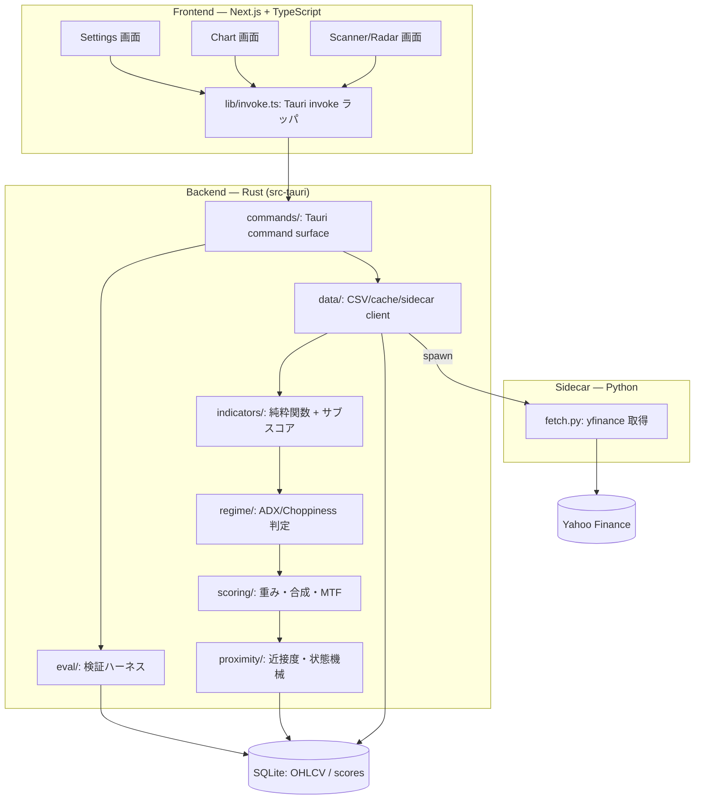

# 01. アーキテクチャ

`docs/00-requirements.md` の実装レベル展開。ディレクトリ構成・モジュール責務・Tauriコマンド契約・サイドカー起動・CI を定義する。

## レイヤー構成



**境界の原則:** 計算（indicators/regime/scoring/proximity/eval）は Rust に閉じる。フロントは計算結果を受け取るだけ。データ取得（ネットワーク）は Python サイドカーに閉じる。Rust コアは直接インターネットに触れない。

## ディレクトリ構成（目標）

```
alpha-radar/
├── CLAUDE.md / README.md / .gitignore
├── docs/
├── src-tauri/
│   ├── Cargo.toml
│   ├── tauri.conf.json          # sidecar を externalBin に登録
│   └── src/
│       ├── main.rs              # Tauri builder, command 登録
│       ├── error.rs             # AppError (thiserror)
│       ├── config.rs            # Config / ScanConfig / MtfConfig + defaults
│       ├── models.rs            # OHLCV, SymbolScore, ChartData 等の DTO
│       ├── data/
│       │   ├── csv.rs           # CSV パース・正規化
│       │   ├── sidecar.rs       # Python サイドカー起動・JSON 受領
│       │   ├── cache.rs         # SQLite I/O・差分更新
│       │   └── universe.rs      # 銘柄ユニバース管理
│       ├── indicators/
│       │   ├── mod.rs           # Indicator trait, 共通ユーティリティ
│       │   ├── trend.rs         # ADX/DMI, Supertrend, EMA ribbon, Ichimoku
│       │   ├── momentum.rs      # MACD, RSI, SqueezeMomentum, TSI
│       │   ├── mean_reversion.rs# ConnorsRSI2, %B, Williams %R, MA z-score
│       │   ├── volatility.rs    # ATR, BB width/Keltner, Choppiness
│       │   └── normalize.rs     # サブスコア正規化 (-1..+1)
│       ├── regime/mod.rs        # Regime 判定
│       ├── scoring/
│       │   ├── weights.rs       # レジーム別カテゴリ重み表
│       │   ├── composite.rs     # 単一TF 合成
│       │   └── mtf.rs           # α 加重 + week/month ゲート
│       ├── proximity/mod.rs     # 近接度・SignalState 機械
│       ├── eval/                # binomial / mfe_mae / walkforward
│       └── commands/mod.rs      # scan_universe / get_chart_data / evaluate_model / config
├── sidecar/
│   ├── fetch.py                 # yfinance ラッパ (CLI/stdin JSON → stdout JSON/Parquet)
│   ├── requirements.txt
│   └── build/                   # PyInstaller 出力 (gitignore)
├── frontend/  (または src/)
│   ├── app/
│   │   ├── page.tsx             # Scanner/Radar (主画面)
│   │   ├── chart/[symbol]/page.tsx
│   │   └── settings/page.tsx
│   ├── components/
│   │   ├── DropZone.tsx
│   │   ├── RankingTable.tsx
│   │   ├── SignalBadge.tsx
│   │   ├── ProximityBar.tsx
│   │   ├── MultiPaneChart.tsx
│   │   └── MtfSummary.tsx
│   └── lib/
│       ├── invoke.ts            # Tauri command ラッパ
│       └── types.ts             # Rust DTO のミラー
└── tests/
    └── fixtures/                # ゴールデン値 (OHLCV slice + expected)
```

## Tauri コマンド契約

```rust
// CSV ユニバース一括スキャン（近接度ランキング込み）
#[tauri::command]
async fn scan_universe(csv_path: String, config: ScanConfig) -> Result<ScanResult, AppError>;

struct ScanResult {
    scores: Vec<SymbolScore>,   // actionability 降順は UI 側でソート可
    errors: Vec<RowError>,      // 行単位の取得/計算失敗
    scanned_at: DateTime<Utc>,
}
struct RowError { symbol: String, reason: String }

// 単一銘柄チャートデータ（OHLC + 全指標系列 + マーカー、3足分）
#[tauri::command]
async fn get_chart_data(symbol: String, tf: Tf) -> Result<ChartData, AppError>;

struct ChartData {
    ohlc: Vec<Candle>,
    overlays: Overlays,         // ema_ribbon, supertrend, ichimoku
    macd_mtf: MacdSeries,
    sqzmom: SqzMomSeries,
    score_series: Vec<(i64, f64)>, // (ts, Score_final)
    markers: Vec<Marker>,       // BUY/SELL @ price
    mtf_summary: Vec<TfSummary>,// 日足/週足/月足 の regime + velocity
}

// スコア/近接度モデル検証
#[tauri::command]
async fn evaluate_model(csv_path: String, eval: EvalConfig) -> Result<EvalReport, AppError>;

// 設定
#[tauri::command]
fn get_config() -> Config;
#[tauri::command]
fn update_config(config: Config) -> Result<(), AppError>;
```

DTO はすべて `serde` で (de)serialize し、`frontend/lib/types.ts` に手動ミラー（または `ts-rs` で自動生成）。

## Python サイドカー起動モデル

- `tauri.conf.json` の `bundle.externalBin` にサイドカーバイナリを登録。Rust から `tauri::api::process::Command::new_sidecar` で起動。
- **I/O 契約:** Rust が **stdin に JSON リクエスト**を渡し、サイドカーは **stdout に JSON（または一時 Parquet ファイルパス）** を返す。1プロセス1バッチ（複数銘柄・複数足を一括）。
- リクエスト/レスポンスのスキーマは `docs/04-data-spec.md`。
- サイドカーは **ステートレス**（取得のみ）。キャッシュ・差分判定は Rust 側（`data/cache.rs`）。

## データフロー（end-to-end）

`CSV drop → csv.rs(正規化) → cache.rs(差分判定: 不足分のみ要求) → sidecar.rs(spawn fetch.py) → yfinance 1d/1wk/1mo → cache.rs(SQLite upsert) → indicators/* (rayon 並列) → regime → scoring(composite→mtf) → proximity → SymbolScore を SQLite + ScanResult で返却 → RankingTable 描画 → 行クリック → get_chart_data → MultiPaneChart`

## 横断的関心事

- **エラー:** `AppError`（`thiserror`）。スキャンは行単位で失敗を収集し全体を止めない（`RowError`）。サイドカー側エラーは構造化 JSON で返し Rust が解釈。
- **ロギング:** `tracing`。取得失敗・計算 NaN・レート制限を記録し UI に集約。
- **キャッシュ:** SQLite を真実源。差分更新（最終バー以降のみ取得）。同一スキャン内の重複銘柄は1回だけ取得。
- **並列:** 銘柄横断は `rayon`。サイドカー呼び出しは銘柄を**バッチ**にまとめてレート制限を尊重（1銘柄1プロセスにしない）。
- **決定性:** インジケーター/スコアは純粋関数・同一入力同一出力。非決定要素（並列の浮動小数集約順序など）が出る場合は明示し、必要なら集約順序を固定。

## CI（GitHub Actions）— 実装済み

**`.github/workflows/ci.yml`**（push / PR → main、`windows-latest` 単一ジョブ）:
- Frontend: `npm ci` → `npx tsc --noEmit` → `npm run lint` → `npm run build`（**Rust より先に必須** — `generate_context!` が `frontendDist` をコンパイル時に埋め込むため）。
- Rust: `cargo test`（ゴールデン値テスト必須通過）、`cargo clippy --all-targets -- -D warnings`（警告ゼロを強制）。
- windows を選ぶ理由: dev 機と一致し、WebView2 標準搭載でシステム依存パッケージが不要（ubuntu は `tauri` crate に webkit2gtk 一式が必要）。

**`.github/workflows/release.yml`**（`workflow_dispatch` + タグ `v*`、matrix）:
- **OS別にサイドカーを PyInstaller でビルド**（`pwsh ./tools/package-sidecar.ps1` — triple/拡張子を自動判定するため無改修で macOS でも動く）→ `bundle.externalBin` 経由で Tauri バンドルに同梱。**クロスコンパイル不可のため各OSのランナーで実行**（PyInstaller は実行環境の Python を、Tauri は各プラットフォームの WebView を要する）。
- matrix: `windows-latest` → NSIS `.exe` / **`macos-latest` → `.dmg`（arm64 / Apple Silicon 専用、未署名 — ADR-18）**。Linux は現状ターゲット外。
- `tauri build --bundles <target>` で `bundle.targets:"all"` を上書き（MSI の WiX ダウンロード起因の flake を回避）。署名鍵は不要（`plugins.updater` 未設定＝updater アーティファクトを要求しない）。
- タグ push 時のみ `gh release create` で各OSインストーラを添付して公開（ノートは `.github/release-notes.md`＝Gatekeeper 回避手順）。
- `workflow_dispatch` はアーティファクトのみ生成しリリースを作らないため、**タグを切らずにパイプラインを試せる**（ただしデフォルトブランチに存在する時のみ手動実行可）。
